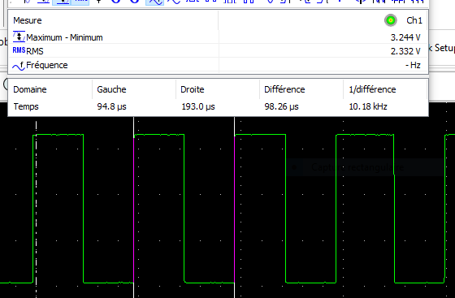
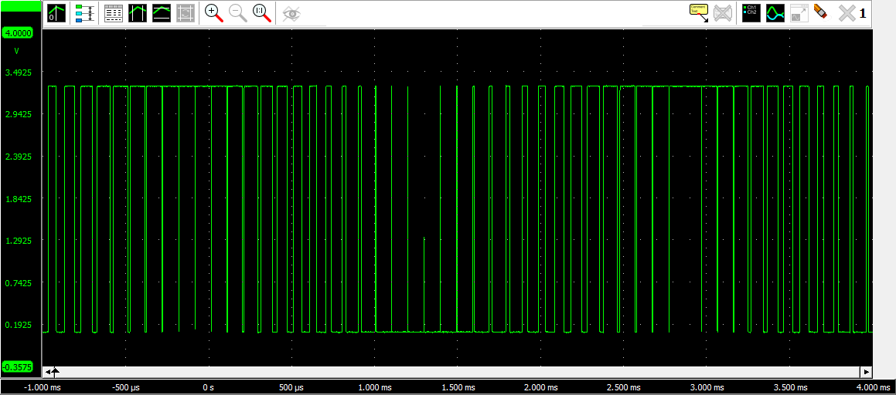
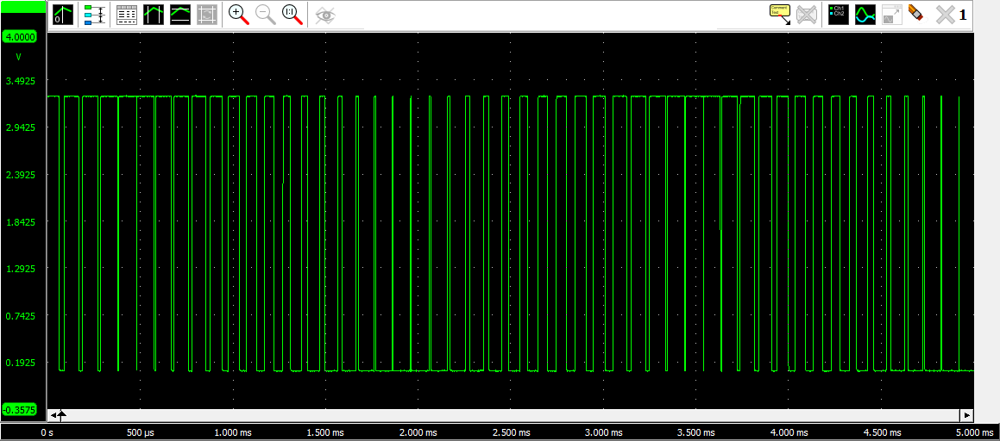

# 8 channel software PWM for the Raspberry PI

This program is an 8 channel PWM generator to be run on a 
raspberry PI4 model. It will then control the voltage on 
the GPIO output 2 to 9. 

The program may be run on a non-raspberry computer in which
case it behaves exactly as on the raspberry but without
GPIO interaction.

Communication with the program is trough a normal TCP connection
over witch messages are exchanged. A message is a line of text
ended by the newline character (\n not \r\n).

The program generates PWMs only when there is an active 
connection and it has been configured to do so. When the connection
is closed, whatever the reason (e.g client crash), the generator
is stopped and all output are set to 0v. 

### PWM generation types and parameters

The generator may generate constant or varying pwm values in 
parallel and idependently on any combination of the 8 channels.
The variation may be sinusoidal or triangular with specified 
amplitude, frequency and phase. The phase is specified as a 
fraction of the period with a value in the range 0 to 1.

To control this behavior, each channel has 5 parameters:

- type: constant(0), sinusoidal(1), triangular(2)
- average: average value
- amplitude: amplitude of variation around the average
- period: duration in second of a variation period
- start: percentage of period where to start

These parameters must respect the following constrains.

- 0 <= average <= 1
- amplitude >= 0
- average + amplitude <= 1
- average - amplitude >= 0
- period >= 0
- 0 <= start < 1

For constant PWM generation, the amplitude, period and start must
all be 0. Setting the average to 0, will keep the GPIO output
to 0v. Setting the average to 1, will keep the GPIO output to 3.3v.

For varying PWM generation, the average, amplitude and period 
must be non-zero. 

### Mean frequency and standard deviation

The generator also continuously measure the frequency of pulse
generation and its standard deviation. The value is a mobile 
value with exponentional decaying weighting with the alpha 
coefficient 0.9. 

### Commands

The commands supported by the generator are

- GPRM : returns the parameters of all the channels
- SPRM : sets the parameters of channels
- FREQ : returns the mobile mean frequency and its standard deviation

Multiple channels may be configured at once when setting the parameters.
The change is atomic (in one step) to ensure that the phase 
difference between the varying signals is exactly the one requested.

Channels not configured with an SPRM request remain unaffected and
continue to generate their output as before. 

To stop the generation of PWM on a channel, configure it to CST and
all parameters to 0. 

The PWM generator accepts only one active TCP connection. When 
another connection is attempted to be made, the program will respond
that it is busy and will provide the IP address and port used for 
the active connection. This allows to identify the host and process 
that currently uses the PWM generator.

## Testing the PMW generator

The following image shows a screen capture of a constant PWM generation
with an average of .5. We can see that the puls frequency is 10kHz. 



The following image shows a sinusoidal PWM generation. The average and
amplitude are .5 and the period is .003.



The following image shows a triangular PWM generation with the same
parameters as the sinusoidal generation.




## Installation

Create the file `/etc/systemd/system/generator.service` with the following content:

```
[Unit]
Description=PWM Generator on GPIO 02 -> 09

Wants=network.target
After=syslog.target network-online.target

[Service]
Type=simple
ExecStart=/usr/local/bin/generator 4000
User=root
Group=root
Restart=on-failure
RestartSec=10
KillMode=process
StandardOutput=append:/var/log/generator.log
StandardError=append:/var/log/generator.err.log

[Install]
WantedBy=multi-user.target
```

Build and install the program for the first time.

```bash
gcc -I. *.c -O3 -latomic -lm -lpthread -Wall -o pwmgenerator
sudo cp pwngenerator /usr/local/bin/generator
```

Enable the service for automatic restart when reboot and start it.

```bash
sudo systemctl enable generator.service
sudo systemctl start generator.service
```

When the source files are modified, you may use the `./build` command
to recompile, install and start the new code version.


## Protocol

The PWM generator communicates over a TCP IP connection by exchanging
text messages ending with a newline character (\n not \r\n). The first
character of response message is > in case of success, and ! in case
of error. In the later case the ! is followed by a human readable text
explaining the reason of error.

Once a TCP connection is established, the client must proceed with the
greeting message exchange. Failing to do so result in the connection
closing by the generator. This protects generator from rogue visitors 
or bogus clients.

### Greeting : PWM0

When the TCP connection is established, the client has 500ms to send 
the message "PWM0" to which the generator respond with 
">HELO v0.1 12bits". The version and resolution might evolve in future
versions. 

If there is already an active connection, the generator respond with 
"!busy with xx.xx.xx.xx:yy" where xx.xx.xx.xx:yy is the IP address 
and port of the active connection. This allows to identify the 
process that is currently using the generator. After sending back 
this message, the generator closes the connection.

### Getting the current parameters : GPRM

When the client sends the message "GPRM" to the generator, it
respond with the list of parameters of the 8 channels. Example:

"8, 0 CST 0.1 0 0 0, 1 TRI 0.5 0.5 0.003 0, 2 CST 0.3 0 0 0, 3 CST 0.4 0 0 0, 4 CST 0.5 0 0 0, 5 CST 0.6 0 0 0, 6 CST 0.7 0 0 0, 7 CST 0.8 0 0 0"

The first number is the number of channels. It is followed by
the parameters of each chanel preceeded by a comma. The first
value of the chanel parameters is the channel number. The
second parameter is the type of generation (CST, SIN, TRI), and
the fours following parameters are respectively the average,
the amplitude, the period and the start values.  

### Getting the average frequency and its standard deviation : FREQ

When the client sends the message "FREQ" to the generator, it
respond with the frequency and its standard deviation. Example:

"10156.55 0.012345"

The first number is the frequency and the second number the standard
deviation. 

### Setting the channel parameters : SPRM

To set the channel parameters, the client must send a message 
starting with "SPRM" and followed by the parameters. Example:

"SPRM 2, 3 CST 0.4 0 0 0, 5 CST 0.6 0 0 0"

The first number after SPRM is the number of channels to be set
and whose parameters follow. The channel parameters encoding is
the same as for GPRM. The first integer number is the channel 
number. It is followed by "CST", "SIN" or "TRI" to specify the
type of variation. The next four floating point parameters
encoded with the formatting code %g, are respectively the 
average, the amplitude, the period and start values.

## Go client

A simple Go client program is also provided with PWM generator
driver package (Go's library). 

### Installing Go

To install Go, follow the directives at https://go.dev/dl/.  

0. add `export PATH=$PATH:/usr/local/go/bin` to your .bashrc file
1. execute the following instructions to download and install Go.
    ```bash
    wget -P /tmp https://go.dev/dl/go1.17.7.linux-amd64.tar.gz
    sudo rm -rf /usr/local/go
    sudo tar -C /usr/local -xzf /tmp/go1.17.7.linux-amd64.tar.gz
    go version
    ```

### compiling and running the client

```bash
cd goClient
go install ./...
```
By default, go creates the directory `~/go` where it stores
all the users go related information. You can define a different
location by setting the `GOPATH` environment variable. The compiled
binaries will be stored in `GOPATH/bin`. Add this directory to 
your `PATH` environment variable. 

The program name is `testPWM` and it accept the IP address and port
of the PWM generator server as unique optional argument. Example

`testPWM 192.168.1.80:4000`

This small program simply get and displays the current parameters of
the 8 channels, set som channels to some values, and then get
again all parameters and display them. It finally waits 2 minutes. It
gives time to check the generated output at the GPIO, or test the
effect of a connection attempt when there is an active connection.

The channels 0 to 7 are mapped to the GPIO output 2 to 9. 

## Testing with bash

- Establish a connection on file descriptor 5: `$ exec 5<>/dev/tcp/192.168.1.11/4000`
- Immediately send the handshake: `$ echo "PWM0" >&5`
- Read the response: `$ head -r 1 <&5` should be `>HELO v0.1.1 12bits`
- Configure all the channels: `echo "SPRM 8, 0 CST 0.1 0 0 0, 1 CST 0.2 0 0 0, 2 CST 0.3 0 0 0, 3  CST 0.4 0 0 0, 4 CST 0.5 0 0 0, 5 CST 0.6 0 0 0, 6 CST 0.7 0 0 0, 7 CST 0.8 0 0 0" >&5`
- Read result: `$ head -r 1 <&5` should be ">DONE"
- Close the connection: `exec 5>&-`

## TODO

- [ ] replace pointers in conn_t by indices to make it copyable
- [ ] create logger function with levels
- [ ] verify code validity by reading
- [ ] run fuzzer to test robustness
